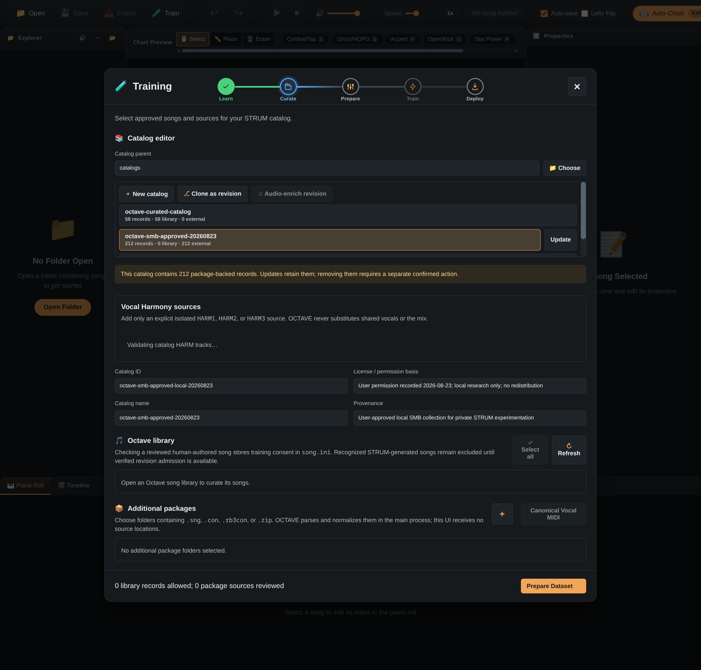
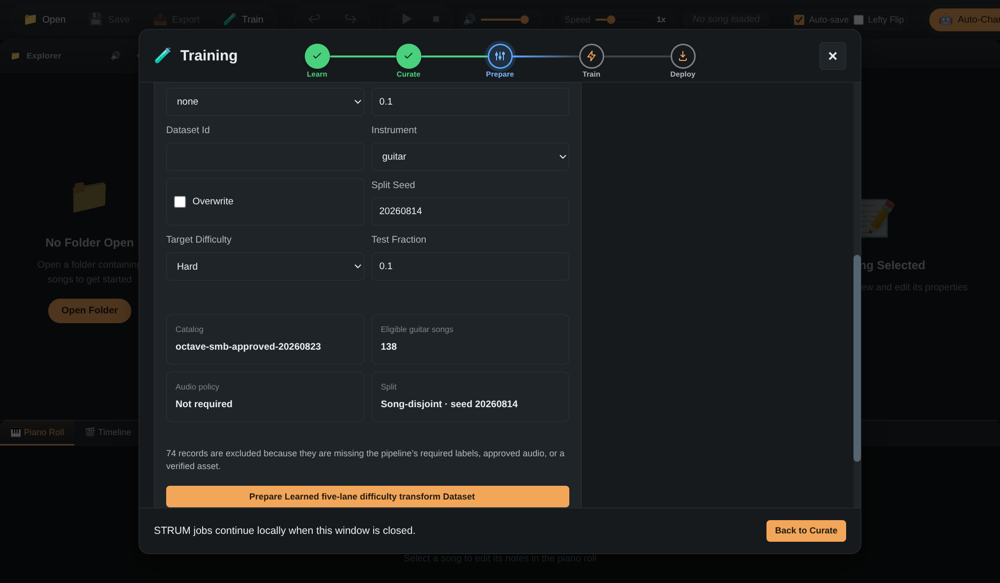
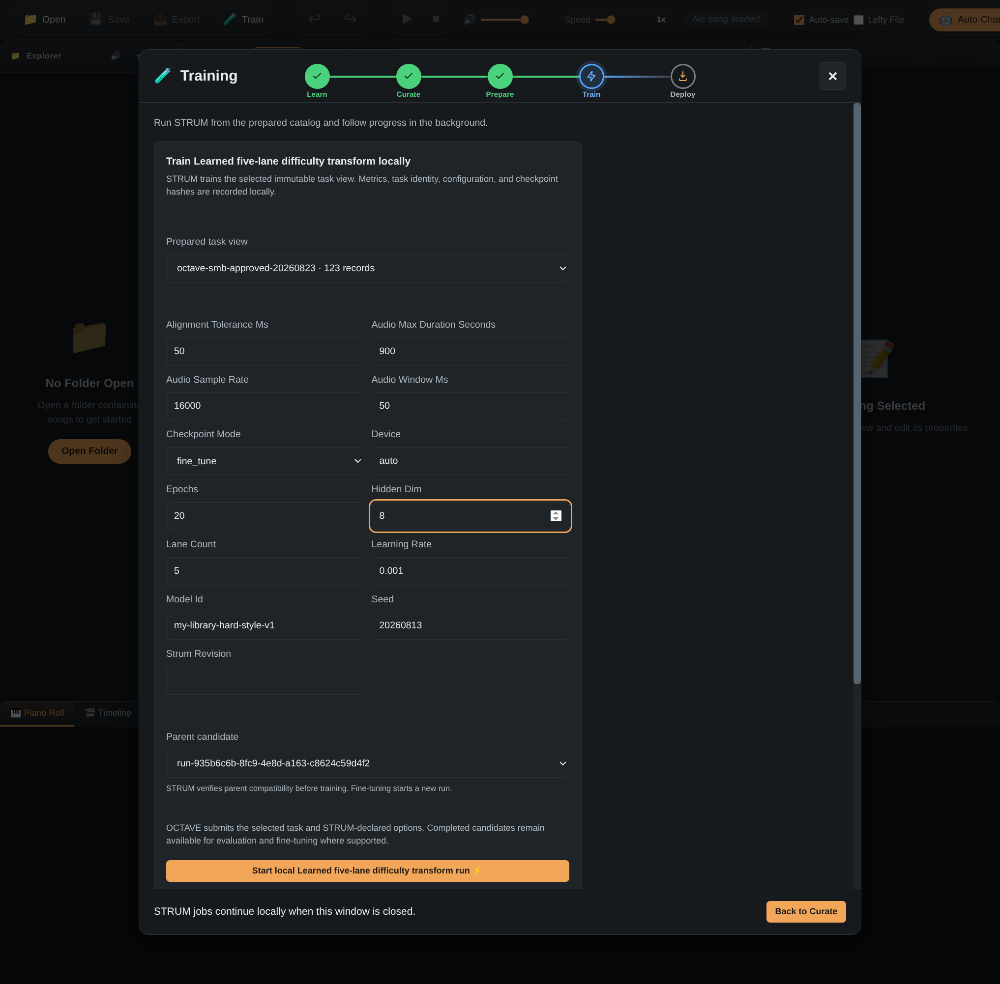
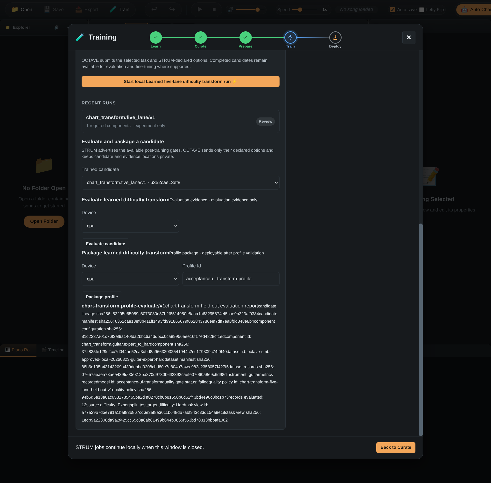
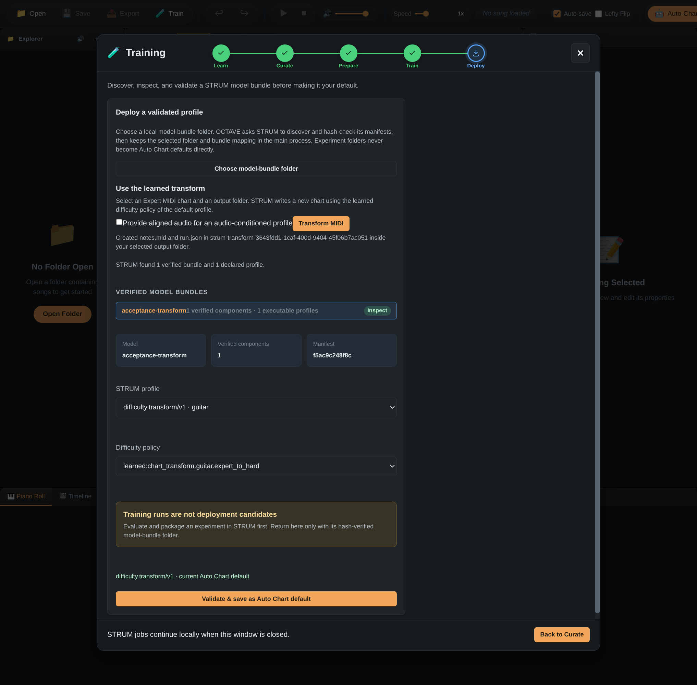
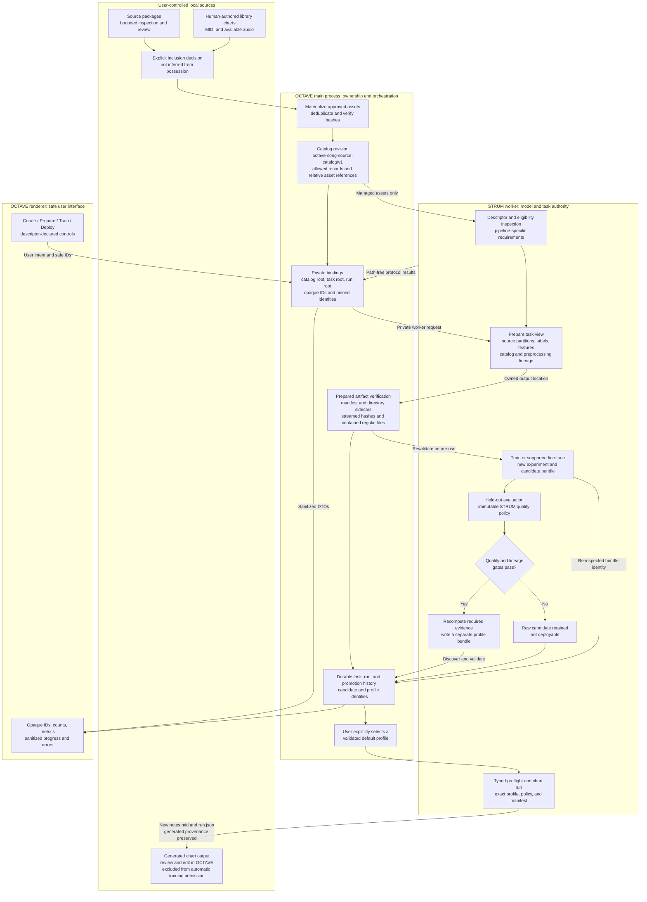
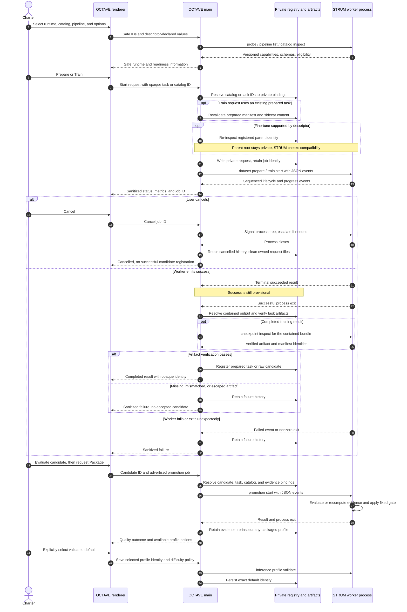
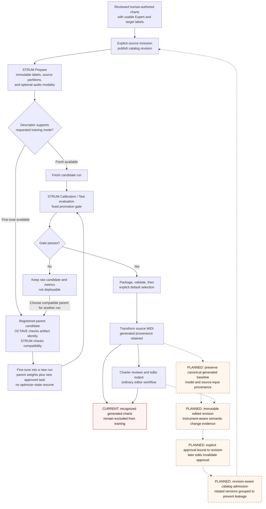

# STRUM training: charter workflow, contracts, and scaling roadmap

This document explains the training workflow implemented for OCTAVE and the work needed to turn it into a reliable personal-charting system. It complements the [orchestration contract](strum-orchestration-contract.md), [illustrated training tutorial](../docs/guide/strum-training.md), and [catalog contract](../docs/reference/song-source-catalog.md).

**Current scope:** OCTAVE can curate approved local sources, prepare STRUM datasets, supervise training and supported fine-tuning, evaluate candidates, package qualifying profiles, and explicitly select and execute a learned MIDI difficulty transform. These are working software paths. They do not establish that a trained model has learned a charter's style or produces release-quality charts.

**Current evidence:** the [approved-catalog worker report](../scripts/acceptance/evidence/2026-09-05-worker-real.json) records a failed quality gate and correctly rejected deployment. The [synthetic positive report](../scripts/acceptance/evidence/2026-09-05-worker-positive.json) and [Electron UI report](../scripts/acceptance/evidence/2026-09-05-ui.json) demonstrate the passing software path, including actual MIDI output and retained history after restart. The synthetic result is an execution fixture, not a musical-quality benchmark. Screenshots in the accompanying pull request show these states; the reports and [acceptance instructions](../scripts/acceptance/README.md) provide their reproducible context.

## Visual evidence from OCTAVE

These are actual Electron screenshots, captured without changing the application's rendered text or results. Preparation, evaluation and deployment come from the successful 10-stage isolated acceptance run against OCTAVE `81f0f6c` and STRUM `b32fa0a`. The Curate screenshot was captured later from the same isolated history, with the consent explanation corrected to match generated-source exclusion. The fine-tune screenshot is a newly captured configuration state using the same isolated acceptance history. No additional fine-tuning run was started for that image, and the user's active OCTAVE settings were not used.

### Curate an approved catalog

The selected approved catalog contains 212 package-backed records. The screen exposes catalog selection, revision controls, permission basis, provenance, and the boundary between existing records and newly selected library/package inputs. The bottom zero counts describe this editor session's new selections, not the selected catalog's 212 retained records. This is a catalog inspection capture, not a new publication run; Harmony-source validation is still in progress in the image.

1. Prepare an approved local library

STRUM reports 138 eligible Guitar Expert/Hard sources from the approved catalog; preparation produces 123 usable paired records. Readiness and prepared-record counts describe different stages. The screen exposes the target difficulty, source-disjoint split seed, and audio requirements.

2. Configure a new fine-tuning run from a verified parent

The Train screen selects a prepared task, `fine_tune` mode, and a completed parent candidate. The displayed model name is an example chosen for this capture; it does not represent a trained or quality-approved style model. STRUM checks compatibility, and fine-tuning creates a new candidate rather than overwriting the parent or resuming optimizer state.

3. Review evaluation evidence before promotion

The real one-epoch candidate remains experiment-only. STRUM's held-out result records the failed quality gate; the acceptance run verifies that packaging and deployment reject it. This screen is evidence of the current UI, including its dense metadata presentation; it is not a polished mockup.

4. Explicitly activate a validated profile and generate MIDI

The independently trained synthetic identity fixture passes the unchanged gate, is inspected and explicitly saved as the isolated app's default, and produces `notes.mid` plus `run.json` through **Transform MIDI**. The harness also verifies generated-source markers in `song.ini` and persistence after restart. Synthetic success demonstrates execution, not musical quality or stylistic personalization.

## 1. Who owns the data and decisions?

OCTAVE owns user choices, source approval, local storage, process supervision, and profile selection. STRUM owns interpretation of the approved catalog: task requirements, labels, features, splits, model behavior, evaluation, promotion policy, and output charts. The renderer never receives the private locations used to execute a job.

Generated output follows a separate chart-authoring path. Recognized generated output remains excluded from training, even when it is imported into the library or its opt-in metadata is changed. The future correction workflow is described below.

### Artifact boundaries

| Artifact                       | Producer and responsibility                                                                                                                                              | What OCTAVE binds or exposes                                                                                                                             |
| ------------------------------ | ------------------------------------------------------------------------------------------------------------------------------------------------------------------------ | -------------------------------------------------------------------------------------------------------------------------------------------------------- |
| Approved catalog revision      | OCTAVE materializes reviewed assets and records their identities. STRUM validates catalog records and asset hashes.                                                      | Private root stays in main; renderer uses catalog ID, display name, and aggregate eligibility.                                                           |
| Prepared task                  | STRUM declares labels, preprocessing, source splits, and task lineage. A task can be one manifest or a directory with paired data.                                       | Main verifies the manifest and accompanying directory tree before training. Changing a sidecar such as `pairs.jsonl` invalidates the prepared task.      |
| Candidate experiment           | STRUM writes model/configuration hashes, task provenance, metrics, and parent lineage where supported. Bundle layout can be the run root or a declared nested directory. | Main resolves only contained bundle locations and re-inspects the returned identity before registering a candidate.                                      |
| Evaluation and profile package | STRUM applies its fixed quality gate and recomputes required evidence during packaging.                                                                                  | Main supplies registered private task/catalog locations; renderer cannot lower a gate or select an arbitrary evidence path.                              |
| Default profile                | User selection, followed by STRUM validation of an executable capability and difficulty policy.                                                                          | Stored artifact/manifest identity is checked again before use. Training completion does not change the default.                                          |
| Generated chart                | STRUM executes a preflight-bound profile and writes typed output artifacts.                                                                                              | OCTAVE verifies output hashes and preserves generated provenance; a transform selection returns safe artifact names rather than private input locations. |

Directory integrity verification is bounded to 10,000 entries and 64 GiB of aggregate prepared content. Hashes are streamed rather than loading the tree into memory. These are current local artifact limits, not promises of distributed training capacity.

## 2. What makes a job complete?

The UI is not the training process. OCTAVE's main process writes a private request, launches the selected versioned worker, interprets its protocol, and owns cancellation and durable history. A terminal success event alone is insufficient: the process must exit successfully and OCTAVE must verify the resulting artifacts.

A failed quality gate is a legitimate result of evaluation. It prevents packaging; it does not mean the training process crashed. A raw candidate remains available for inspection or a supported new fine-tune run, but cannot bypass promotion by being selected as a default.

For **Transform MIDI**, native dialogs choose the Expert source MIDI, optional aligned audio, and an output folder. Main passes `source_midi_path` and `song_path` privately. STRUM's capability set must include `chart_preflight`, `chart_run`, and `typed_chart_results`; the legacy `chart` label alone does not establish this contract. Cancellation during native selection stops the remaining dialog flow when the active dialog returns.

## 3. How can a charter train toward their own style today?

The current personal-training path is strongest for **learned difficulty transforms**. A charter can curate reviewed, human-authored songs containing Expert and target-difficulty charts, prepare the instrument/difficulty task, and train on those examples. Fine-tuning is supported only where the selected descriptor advertises it; it is not a universal option for every STRUM component.

1. **Choose consistent examples.** Build an approved catalog from charts whose target-difficulty decisions reflect the desired style. For a Guitar Expert-to-Hard transform, the training evidence is the paired Expert and Hard chart data selected by STRUM. Unrelated library tracks do not become training labels merely by being present in a folder.
2. **Prepare a new immutable task.** Select the instrument and target difficulty. Optional audio conditioning must be selected during preparation and remains bound to the resulting task and candidate; adding a catalog location later does not change the model's modality.
3. **Choose Fresh or an eligible Fine-tune parent.** For fine-tuning, select a registered compatible candidate through its opaque artifact ID. OCTAVE verifies its bundle identity; STRUM checks the architecture, task/configuration compatibility, and checkpoint provenance. This initializes a **new run** from the parent weights. It does not resume the parent's optimizer/scheduler session or rewrite that parent.
4. **Evaluate on unseen sources.** Transform checkpoint and decoder selection use Calibration; promotion evidence is measured on Test. Do not repeatedly choose training settings against Test and then call it unseen evidence. Preserve a separate final charter-review set when comparing many personal experiments.
5. **Promote only after the existing gate passes.** STRUM owns the thresholds and evidence checks. Explicitly select a validated packaged profile; retain prior profiles for manual switching back.
6. **Generate and inspect charts.** Transform a source Expert MIDI using the selected profile, then review the result in the editor and in play. Musical quality and playability require judgment beyond aggregate lane metrics.

A model ID or profile name labels an experiment; it is not a style instruction. There is no natural-language “chart like me” control. Style can only be reflected through the supported training data, task representation, and model capacity. The current transform predicts lane activity at the source chart's event times using lane/context features and optional audio features. It does not constitute an unrestricted arrangement, timing, sustain, or articulation model, and it cannot be assumed to learn every preference expressed by a charter's edits.

The opportunity for charters is to define their preferred reduction through examples: which source events survive into Hard, which lanes or chords are retained, and how dense that result should feel. A consistently authored library can supply those targets, and a compatible parent can provide a starting point for a new experiment. Keep contrasting styles in separately reviewed datasets and named profiles so a charter can evaluate and select each deliberately. Whether those preferences generalize must be demonstrated on unseen songs and through playtesting; the present acceptance fixture does not establish it.

### Current authoring loop and planned correction loop

Solid paths below are available today. Dashed paths describe unimplemented generated-chart revision admission. They must not be presented as enabled features.

The planned loop needs more than an opt-in checkbox. OCTAVE must preserve a baseline, prove a meaningful chart-level change, and bind consent to that exact accepted revision. Deleting generated provenance, renaming a song, changing `dataset_opt_in`, or editing metadata cannot substitute for those missing guarantees. Older catalogs are not retroactively certified by the new exclusion checks; consult the [generated admission rules](../docs/reference/song-source-catalog.md#generated-chart-admission).

## 4. Scaling roadmap and release gates

These are ordered engineering phases, not committed delivery dates. The existing implementation is a local pipeline; a larger catalog, more GPU memory, or more epochs does not by itself establish better style learning or safe promotion.

| Phase                                                     | Current foundation                                                                                                                                                   | Additional implementation or evidence                                                                                                                                                                                                               | Exit criterion                                                                                                                                                                                                 |
| --------------------------------------------------------- | -------------------------------------------------------------------------------------------------------------------------------------------------------------------- | --------------------------------------------------------------------------------------------------------------------------------------------------------------------------------------------------------------------------------------------------- | -------------------------------------------------------------------------------------------------------------------------------------------------------------------------------------------------------------- |
| **0 — Reproducible local execution**                      | Explicit compatible runtime selection, versioned worker protocol, catalog preparation, protected artifacts, job lifecycle, promotion, and typed transform execution. | Keep the accepted companion revision and environment documented; rerun process and UI acceptance when a boundary changes.                                                                                                                           | Clean builds/tests plus both a rejected real-catalog candidate and a separately labeled positive execution fixture. This does not certify model quality.                                                       |
| **1 — Useful personal transform quality**                 | Approved paired charts, fresh/fine-tune runs, source-disjoint evaluation, fixed promotion policy.                                                                    | Assemble sufficient consistent human-authored examples; document genre/instrument/difficulty coverage; compare candidates with a reserved final evaluation set and charter playtests.                                                               | Candidate passes the unchanged STRUM policy and documented human review on genuinely unseen songs. No automatic default change.                                                                                |
| **2 — Larger local catalogs and runs**                    | Bounded/resumable source inventory, catalog revisions, streamed integrity checks, private artifacts, durable history.                                                | Measure preparation/training/storage bottlenecks; design content-addressed reusable caches, storage estimates, retention controls, and sharded dataset readers where needed. Preserve lineage across caching/sharding.                              | A declared larger workload completes within measured resource budgets, without weakening source approval, artifact integrity, or cancellation. Current tree limits remain explicit until deliberately revised. |
| **3 — Verified correction admission**                     | Generated provenance and a fail-closed exclusion boundary.                                                                                                           | Baseline/revision storage, instrument-aware semantic diffs, revision-bound approval, deduplication and grouping of related revisions across splits, auditable retraction.                                                                           | An edited generated chart can enter a new catalog only with verifiable baseline/change/approval evidence; unchanged or metadata-only revisions remain rejected.                                                |
| **4 — Broader model composition**                         | Descriptor-advertised Vocal/Pro/mapper/section experiments and existing instrument-specific gates.                                                                   | Implement and evaluate missing composed models, checkpoint contracts, companion/runtime handlers, and chart-level quality tests. Keep experiment-only capabilities explicit.                                                                        | Each claimed chart capability has its own end-to-end held-out evidence and registered execution handler. Component accuracy alone is insufficient.                                                             |
| **5 — Managed releases and additional execution targets** | Developer checkout and installed-worker selection; local process lifecycle.                                                                                          | Publish immutable verified runtime releases; then implement opt-in acquisition, locking, update/rollback and offline behavior. Design remote/multi-GPU scheduling only with explicit data-location, cancellation, and artifact-ownership contracts. | Reproducible verified installation and supported-platform acceptance. No mutable-branch downloads or implicit transfer of private catalogs.                                                                    |

### Limitations reviewers should keep visible

- **Quality:** the current approved-catalog transform result remains below its immutable promotion gate. The synthetic identity profile proves that the software can complete the positive path; it is not a production personal model.
- **Training modes:** chart-transform fine-tuning starts a new experiment from a verified compatible parent. Portable optimizer-state resume remains unsupported.
- **Input modality:** a learned difficulty transform requires source MIDI. Audio-conditioned profiles additionally require compatible aligned audio; audio-only Auto-Chart is a different inference contract.
- **Instrument capabilities:** Guitar/Bass/Keys Expert profiles require their profile-grade admission and Test gates. A trained Drums onset evaluator is distinct from the existing V14 audio-to-chart profile. Vocal, Pro, mapper, and section components do not imply completed composed chart profiles.
- **Feedback:** recognized generated-chart corrections cannot yet be admitted as training sources, because baseline/revision verification is not implemented. Ordinary chart editing remains available.
- **Deployment:** source approval, packaging, and default selection are separate user-controlled decisions. No background training loop silently opts songs in or activates a candidate.
- **Scale and portability:** current evidence covers the recorded local environment and bounded runs. Distributed training, every operating system, a signed runtime distribution, and large-library performance are not established by the present acceptance reports.

## Review map

- [User workflow and setup](../docs/reference/strum-training.md)
- [Catalog ownership and generated-source admission](../docs/reference/song-source-catalog.md)
- [Detailed OCTAVE–STRUM contract and historical evidence](strum-orchestration-contract.md)
- [Acceptance commands and evidence interpretation](../scripts/acceptance/README.md)
- [Worker and UI evidence files](../scripts/acceptance/evidence/)

The diagrams document the existing ownership boundary and the proposed next steps. Only the paths explicitly marked current should be used to describe shipped behavior in the pull request.
